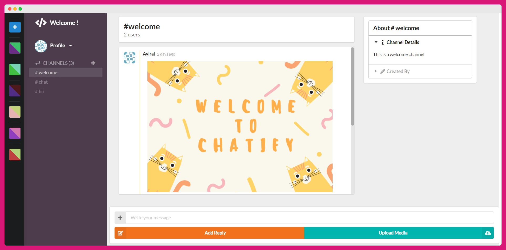
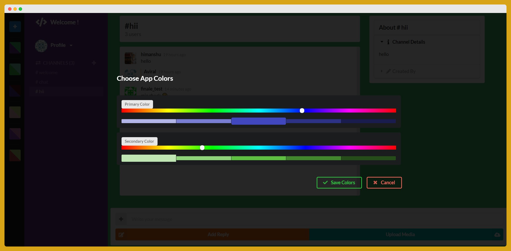
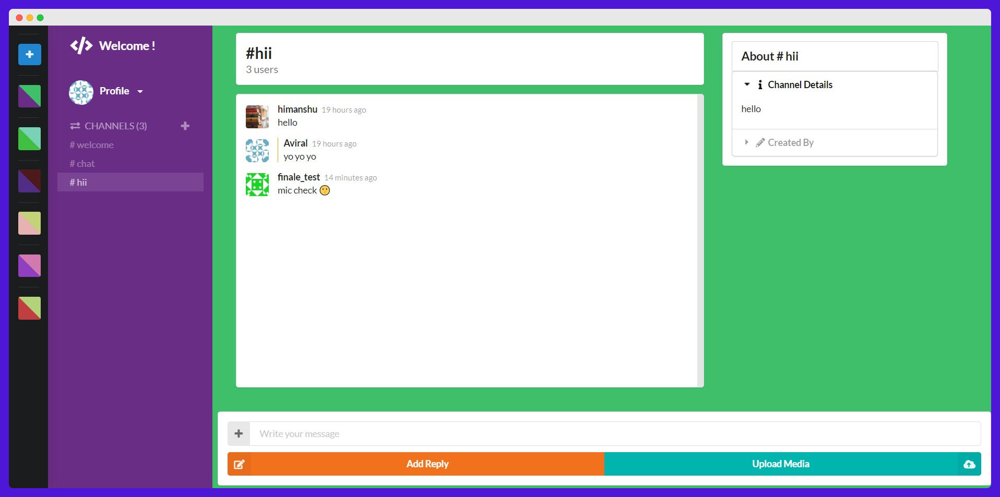
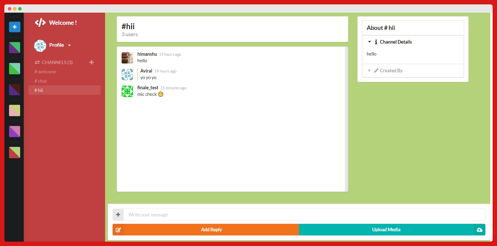

# Chatify (https://chatify-4150c.web.app/)

## `Section Links`
- [Introduction](#Introduction)  
- [Features](#Features)  
- [Tech Stack](#Tech-Stack)  
- [Installation](#Installation)  
- [Preview Images](#Preview-Images) 
- [Upcoming Features](#Upcoming-Features) 
- [Contribution](#Contribution)
- [Contact](#Contact)  
<br/>

## `Introduction`
Chatify is a slack based chat application. You can make your channels/workspaces and can connect with your friends easily.<br/><br/>

## `Features`
💡 Authentication<br/><br/>
💡 Create different channels/workspaces<br/><br/>
💡 Image uploading in chat<br/><br/>
💡 Emojis<br/><br/>
💡 Users can easily change the app themes according to their preferences<br/><br/>
💡 Feature of sending direct(private) messages to users.<br/><br/>
💡 Track of online/offline users.<br/><br/>

## `Tech-Stack`
- React JS
- Firebase
<br/><br/>

## `Installation`
### Step - 1
```
git clone https://github.com/aviraltandon21/Chatify.git
```
### Step - 2
```
npm install
```
### Step - 3

Create an `firebase.js` file in src folder and add following firebase credentials
```
  apiKey: "",
  authDomain: "",
  databaseURL: "",
  projectId: "",
  storageBucket: "",
  messagingSenderId: "",
  appId: "",
  measurementId: ""
```
> 📣 NOTE : You have to create your own firebase project in firebase console and you will get the credentials from there.

### Step - 4
```
npm start
```
<br/>

## `Preview-Images`
### Chat Screen
<br/>
<p>
  
</p>

### Change themes
<br/>
<p>
  
</p>

### Different themes
<p>
  
  
</p>

<br/>

## `Upcoming-Features`

💡 Notifications for unseen messages.<br/><br/>
💡 Search bar for channel for searching the messages.<br/><br/>
💡 Feature of adding favorite channels.<br/><br/>
💡 Indicator when other user is typing.<br/><br/>
💡 Feature for changing the profile picture ( for user )<br/><br/>
💡 Profile page for user where he/she can update his/her perosnal details ( status , email address, etc )<br/><br/>

## `Contribution`

There are many ways you can contribute.<br/>
<br/>
⚡ Refactoring<br/><br/>
⚡ Improving Responsive layout<br/><br/>
⚡ Better flow of operations<br/><br/>
⚡ Add more features ( specified above in - [Upcoming Features](#Upcoming-Features) )<br/><br/>
⚡ Finding bug or issues<br/><br/>

Feel free to send a pull request.

## `Contact`

For any issues feel free to [contact me](https://aviraltandon.com/)
<hr/>

⭐ Thankyou so much ! <br/>
Dont forget to star ⭐ the project if you loved it. ⭐


